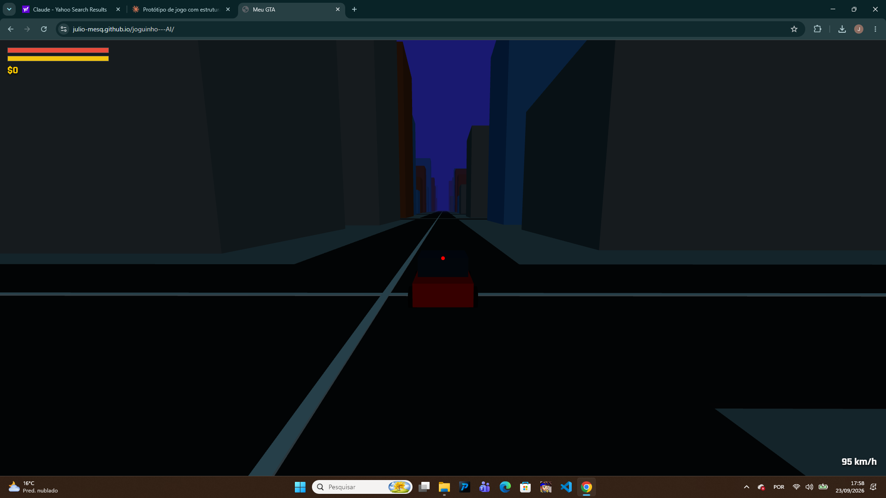

# City Rush

Jogo 3D de mundo aberto no navegador (Three.js). Sem servidor: o progresso fica salvo no próprio navegador (IndexedDB).

## Jogar
Extraia o zip e dê dois cliques em `iniciar.bat` (Windows) ou execute `./iniciar.sh` (Mac/Linux). Precisa de Python 3 e internet (Three.js vem de CDN).
Ou: `python -m http.server 8000` na pasta e abra http://localhost:8000 (módulos ES não funcionam por `file://`).

## GitHub Pages
Envie o **conteúdo** da pasta para um repositório; Settings > Pages > branch `main`, pasta `/ (root)`.

## Controles
WASD mover · Shift correr · C agachar · Espaço pular (freio no carro) · Mouse esq. atira/soca · Mouse dir. mira/zoom · R recarregar · 1-6 armas, 7 punhos · E entrar em carro/loja/casa · H buzina · ← → rádio (no carro) · G falar com NPC · V câmera (no carro: 3ª pessoa/interno) · Tab inventário · M mapa com GPS · T celular · K chuva · P modo foto · B cor do carro · Y split-screen (J2: I/K andar, J/L girar, U pular, O socar) · HESOYAM

## Recursos
Trânsito com semáforos, aviões, 2 praias, mercados/postos com interior, casas à venda (descansar e salvar), 8 marcas de carro, garagem, celular (missões, site de carros/casas/investimentos), mini-jogos (Corrida e Sobrevivência, pelo celular ou falando com o Rafa de laranja perto do início), NPCs que fogem ou brigam, rádio com 4 estações, missão principal com 3 finais.

## Módulos
`main.js` (liga tudo) · `src/`: world, player, vehicles, npcs, traffic, interiors, weapons, audio, ui, choices, pov, effects, weather, missions, minigames, phone, db.

## Ainda não incluído
Modelos .glb realistas, física com Cannon/Rapier, Howler/GSAP, texturas .webp, LOD/chunks, multiplayer online.
